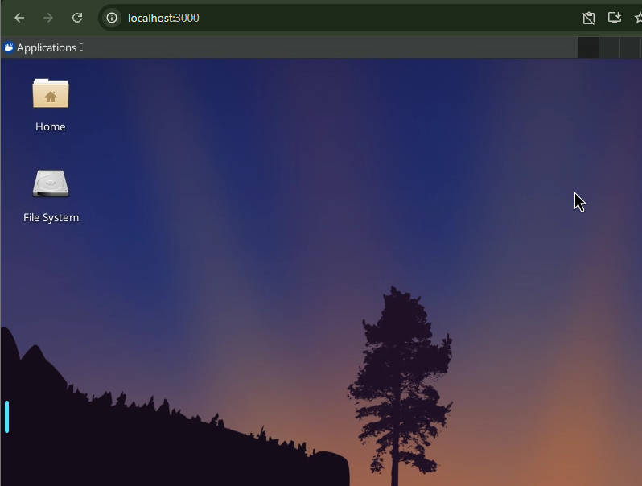
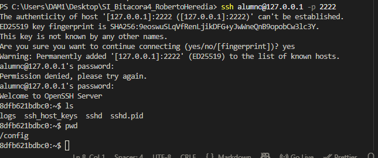
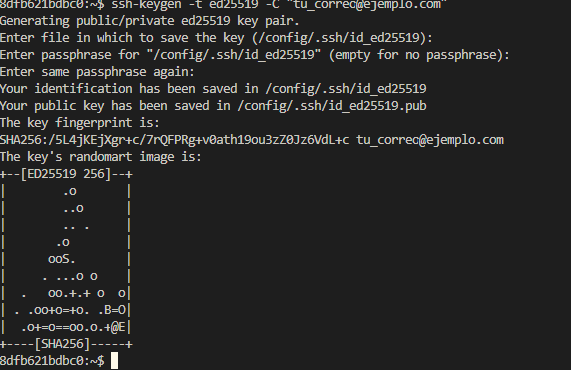
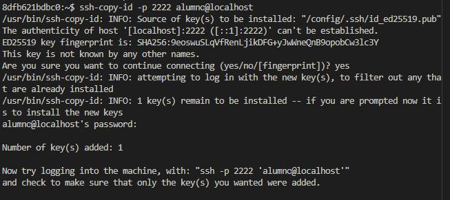
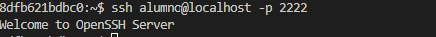
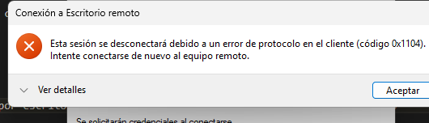
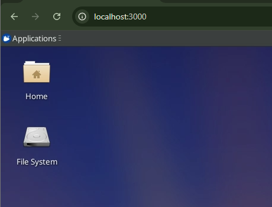
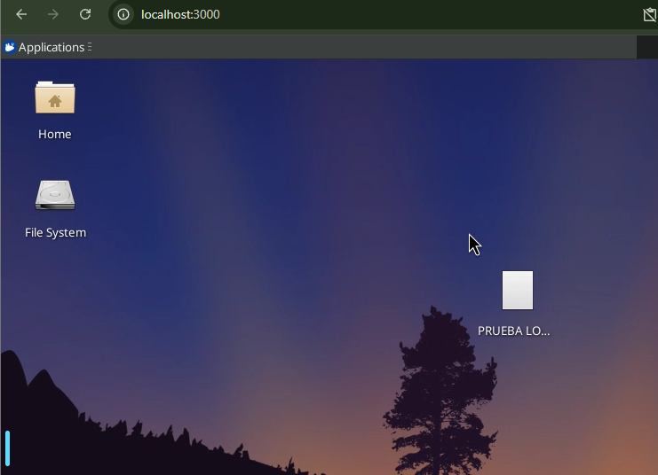
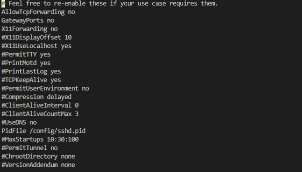

# Tarea 1: Despliegue de la Infraestructura

# SSH: Forjando la Llave Maestra

Paso A (Conexión Inicial): Conéctate al contenedor usando ssh alumno@localhost -p 2222. La contraseña es sistemas_informaticos.

En este caso nos sale un error entrando con @localhost entonces usamos la ip de local host 127.0.0.1

# Paso B (Generación de Identidad): En tu máquina anfitriona, generaremos un par de llaves: ssh-keygen -t ed25519 -C "tu_correo@ejemplo.com"

# Paso C (Transferencia): Copia tu llave pública al servidor. Puedes usar ssh-copy-id -p 2222 alumno@localhost o hacerlo manualmente pegando el contenido en ~/.ssh/authorized_keys dentro del contenedor.

Creamos la key para poder iniciar sesion sin contraseña con alumno para ello usaremos el comando de la siguiente imagen 

Y probamos que modemos iniciar sesion sin contraseña 
Este es el problema que tenemos:
El error de Escritorio Remoto 0x1104 ("Protocol Error at the Client") indica un fallo de compatibilidad o configuración en la conexión RDP [0x5.3]. Generalmente se soluciona desactivando estilos visuales en la experiencia de cliente, habilitando el acceso remoto o ajustando el firewall de Windows para permitir RDP en la máquina destino [0x5.1, 0x5.4].

# 3.2. RDP: El Escritorio en tu Navegador
Nos sale error al contectarnos por escritorio remoto 

Nos conectamos por localhost:3000 ya que por escritorio remoto no sale que ya tenemos a alguien conectado 

Creamos la prueba 

# Configuracion del sshd_config

